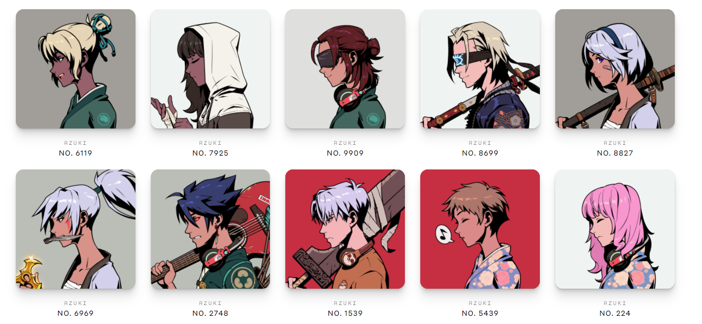

# Azuki

Formed by Chiru Labs, Azuki is an anime brand crafting stories and experiences that blur the lines between the physical and digital worlds. Here are some things we've created so far. IKZ aka ikuzo (行くぞ) is a Japanese phrase meaning "Let's go!" Azuki (小豆) means “red bean” in Japanese.

Azuki is a profile picture (PFP) non-fungible token (NFT) collection of 10,000 anime inspired avatars that enables holders to participate in exclusive drops, experiences, and grants them access to The Garden, a space integrated by artists, builders, and web3 enthusiasts.



## Subgraph URL
```
https://thegraph.com/explorer/subgraphs/68vsUkuPeGbYu8rSGTcDmpRyLBK72nhpdxQbhYFQJKYp?view=Overview&chain=arbitrum-one
```

## GraphQL Endpoint

You first need to create an `API-KEY`. See: https://youtu.be/UrfIpm-Vlgs
```
https://gateway-arbitrum.network.thegraph.com/api/[api-key]/subgraphs/id/68vsUkuPeGbYu8rSGTcDmpRyLBK72nhpdxQbhYFQJKYp
```
## Queries

A list of example queries you can make can be found here: [Queries.md](Queries.md)

## Links

- https://www.azuki.com/
- https://opensea.io/collection/azuki


## Run your local Graph Node

```bash
ETHEREUM_RPC=mainnet:https://eth-mainnet.alchemyapi.io/v2/${YOUR_API_KEY}
```

Run the command: `docker compose up`

## Build

- Initialize subgraph (Subgraph Studio):
  ```
  graph init --product subgraph-studio
  --from-contract <CONTRACT_ADDRESS> [--network <ETHEREUM_NETWORK>] [--abi <FILE>] <SUBGRAPH_SLUG> [<DIRECTORY>]
  ```
- Initialize subgraph (Hosted Service):
  ```
  graph init --product hosted-service --from-contract <CONTRACT_ADDRESS> <GITHUB_USER>/<SUBGRAPH_NAME>[<DIRECTORY>]
  ```
- Generate code from manifest and schema: `graph codegen`
- Build subgraph: `graph build`

## Deploy

- Authenticate (just once): `graph auth --product hosted-service <ACCESS_TOKEN>`
- Deploy to Subgraph Studio: `graph deploy --studio <SUBGRAPH_NAME>`
- Deploy to Hosted Service: `graph deploy --product hosted-service <GITHUB_USER>/<SUBGRAPH_NAME>`
